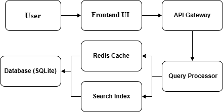
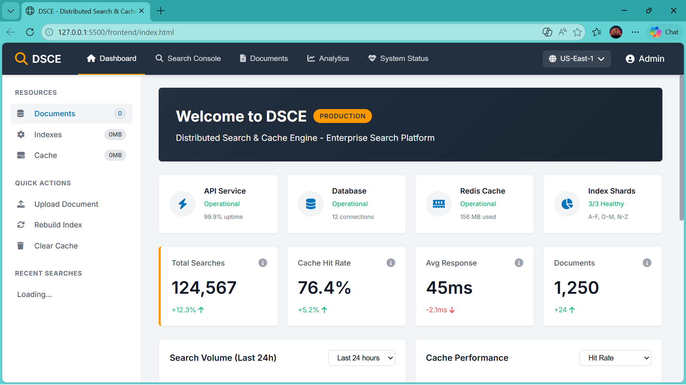
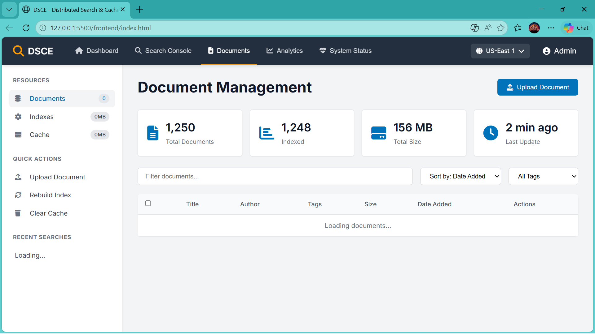

# Distributed Search & Cache Engine (DSCE)

## Scalable Distributed Cache System

A production-ready, scalable search engine demonstrating distributed caching, inverted indexing, and real-time analytics. Built with FastAPI, Redis, and modern web technologies.

## Features

- **Full-Text Search** - Inverted index-based search with relevance ranking
- **Distributed Caching** - Redis caching with adaptive TTL for popular queries
- **Real-Time Analytics** - Live dashboard with search metrics and performance monitoring
- **Document Management** - Upload, index, and manage documents
- **Fault Tolerance** - Automatic fallback if cache fails
- **Rate Limiting** - Prevent API abuse
- **Index Sharding** - Simulated distributed indexing (A-F, G-M, N-Z)
- **Synonym Expansion** - Smart term matching (AI ↔ Artificial Intelligence)
- **Performance Metrics** - Track query latency and cache hit rates

## Tech Stack

**Backend**
- FastAPI - High-performance async web framework

- Redis - Distributed caching layer

- SQLite - Lightweight database (easily swappable with PostgreSQL)

- NLTK - Natural language processing for tokenization

- Pydantic - Data validation and settings management

**Frontend**

- HTML5/CSS3 - AWS-inspired responsive design

- JavaScript - Async search and real-time updates

- Font Awesome - Icons and UI elements

- Chart.js - Analytics visualizations

**DevOps**

- Docker - Containerization

- Docker Compose - Multi-container orchestration

- Git - Version control

## Architecture

  
   
  <em>Architecture</em>

### Data Flow
1. **Query Reception** - User submits search via UI
2. **Cache Lookup** - Redis checked for cached results
3. **Cache Hit** - Instant response from cache
4. **Cache Miss** - Query processed through inverted index
5. **Result Ranking** - Documents ranked by relevance
6. **Cache Update** - Results stored in Redis with adaptive TTL
7. **Analytics Update** - Metrics recorded for dashboard

 

## Screenshots

  
  
   
  <em>Left: Dashboard | Right: Document Section</em>

## Sample Output

## Installation

### Prerequisites
- Python 3.9 or higher
- Redis 7.0 or higher (or Docker)
- Git

**Future Improvements**

- PostgreSQL Integration - Replace SQLite with PostgreSQL for production

- Elasticsearch Backend - Add Elasticsearch as an alternative search engine

- User Authentication - Add JWT-based authentication

- Advanced Analytics - More detailed search analytics with time-series data

- Distributed Deployment - Kubernetes deployment configuration

- Full-Text Search Enhancements - Add fuzzy search and phonetic matching

- Machine Learning Ranking - Implement learning-to-rank algorithms

- WebSocket Support - Real-time search suggestions

- Multi-language Support - Internationalization

- Mobile Responsive - Enhanced mobile UI

**Author**
- Name  : Meenakshi Sundaram N
- Email : nmeenakshisundaram257@gmail.com